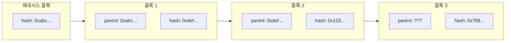
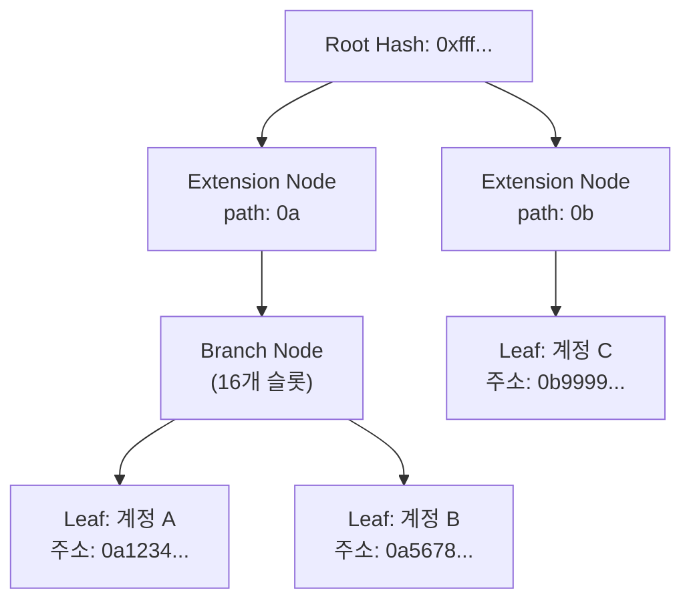

# Week 4 Quiz: Network/Block + wagmi

> **제출 방법:** 이 파일을 복사하여 답변을 작성한 후, PR로 제출하세요.
> **평가 기준:** 개념 이해도 중심 - 문법 오류보다 논리적 설명을 중시합니다.

---

## 문제 1: 블록 헤더 필드 (객관식)

다음 상황을 고려하세요:

```
블록 100의 해시: 0xabc123...
블록 101의 해시: 0xdef456...
```

블록 101의 `parentHash` 필드에는 어떤 값이 저장되어 있나요? 그리고 **왜** 이런 방식으로 연결하나요?

**보기:**
A) 0xdef456... - 자기 자신의 해시를 저장하여 무결성을 보장한다
B) 0xabc123... - 이전 블록의 해시를 저장하여 체인 연결과 불변성을 보장한다
C) 블록 번호 100 - 숫자로 순서를 추적한다
D) 빈 값 - 헤더에는 해시가 저장되지 않는다

**답변:**

<!--
정답 알파벳과 왜 이 답을 선택했는지 설명하세요.
다른 보기가 왜 틀린지도 간략히 설명해 주세요.
-->

## B - 블록에 있는 hash값은 내부의 값에 기반하여 저장되는데 이를 통해서 내부의 값이 바뀌게 된다면 이전 블록의 해시값도 바뀌게 되어 블록체인의 불변성이 깨지게 된다. 이걸 통해서 데이터를 보존할 수 있는 환경을 조성한다.

A - 자기 자신의 해시는 이미 저장되어 있기 때문에 parentHash로 저장되지 않는다. 저장하게 되면 circular 의존성이 발생하여 구조가 무너진다.
C - 블록 순서는 큰 상관이 없다..
D - 헤더에는 Hash값이 항상 존재하게 된다.

---

## 문제 2: MPT 목적 (객관식)

이더리움에서 Merkle Patricia Trie(MPT)를 사용하는 **가장 중요한 이유**는 무엇인가요?

**보기:**
A) 데이터를 암호화하여 외부에서 읽을 수 없게 한다
B) 트랜잭션 처리 속도를 10배 이상 높인다
C) 전체 데이터 없이도 특정 데이터의 존재와 정확성을 효율적으로 증명한다
D) 블록 크기를 줄여서 저장 공간을 절약한다

**답변:**

<!--
정답 알파벳과 왜 이 기능이 중요한지 설명하세요.
Light Node와 연결지어 설명하면 더 좋습니다.
-->

C - 전체 데이터가 없어도 특정 데이터의 존재와 정확성을 효율적으로 증명한다. Light Node는 전체 블록체인을 다운로드하지 않고도 필요한 데이터에 접근할 수 있게 해준다.

---

## 문제 3: 체인 연결과 보안 (객관식)

공격자가 블록 50의 트랜잭션을 수정하려고 합니다. 현재 체인의 최신 블록은 100입니다. 이 공격이 **왜** 어려운가요?

**보기:**
A) 블록 50은 너무 오래되어서 시스템에서 접근할 수 없다
B) 블록 50을 수정하면 해시가 바뀌고, 블록 51부터 100까지 모든 블록의 parentHash가 불일치하게 된다
C) 블록 50은 이미 암호화되어 있어서 복호화 키가 필요하다
D) 네트워크 관리자만 과거 블록을 수정할 수 있다

**답변:**

<!--
정답 알파벳과 블록체인의 불변성이 어떻게 작동하는지 설명하세요.
-->

B - 블록체인의 체인특성인 꼬리를 잇는 해시함수의 작동이 일그러지게 된다. 따라서 블록 51의 parentHash가 불일치하게 되고, 이후 100번째의 블록까지 영향을 미치게 된다.

## 문제 4: MPT 진화 과정 (단답형)

MPT(Merkle Patricia Trie)는 세 가지 자료구조의 장점을 결합한 것입니다:

1. **Trie** -> 2. **Patricia Trie** -> 3. **Merkle Patricia Trie**

**왜** 각 단계의 발전이 필요했나요? 각 단계가 해결하는 문제를 간단히 설명하세요.

**답변:**

<!--
1. Trie가 해결하는 문제:

2. Patricia Trie가 해결하는 문제 (Trie의 한계):

3. Merkle Patricia Trie가 해결하는 문제 (Patricia Trie의 한계):

-->

1. Trie가 해결하는 문제 : key-value 값을 통한 효율적인 데이터 검색을 활성화 시켰다.
2. 2-1. Trie의 한계 : 노드가 많아질수록 너무 많은 불필요한 메모리를 사용하게 되었다.
   2-2 Patricia Trie : Path Compression을 통해 메모리 사용을 최적화 하는데 기여했다.
3. 3-1. Patricia Trie의 한계 : 데이터의 무결성을 검증할 수 있는 방법이 없었다.
   3-2. Merkle Patricia Trie : 각 노드에 해시값을 추가하여 데이터의 무결성을 검증할 수 있게 되었다.

---

## 문제 5: Eclipse Attack 방어 (단답형)

Eclipse Attack은 공격자가 피해자 노드의 **모든 피어 연결**을 자신이 통제하는 노드로 바꾸는 공격입니다.

1. 이 공격이 성공하면 피해자에게 **어떤 피해**가 발생할 수 있나요?
2. 개인 노드 운영자가 이 공격을 **방어**하기 위해 할 수 있는 행동은 무엇인가요?

**답변:**

<!--
1) 가능한 피해 (2가지 이상):


2) 방어 방법 (2가지 이상):

-->

1-1 Double Spending Attacks : 피해자가 자신의 자산을 두 번 이상 사용하는 공격이 발생할 수 있다.
1-2 Selfish Mining & Power Deilution : 공격자가 블록 생성 권한을 독점하여 네트워크의 공정성을 해칠 수 있다.
2-1 Peer diversity : 랜덤 커넥션을 수락하는 대신, 다양한 피어와 연결하여 공격자가 특정 피어를 통제하기 어렵게 만든다.
2-2 Anchor Connections : 신뢰할 수 있는 피어와의 연결을 유지하여 공격자가 네트워크를 장악하기 어렵게 만든다.

---

## 문제 6: 노드 종류 선택 (단답형)

친구가 이더리움 개발을 시작하려고 합니다. 다음 세 가지 상황에서 각각 어떤 노드 타입(Full, Light, Archive)을 추천하시겠습니까? **왜** 그 노드를 추천하는지도 설명하세요.

1. 모바일 지갑 앱 개발
2. 블록체인 데이터 분석 서비스 개발
3. 일반적인 dApp 백엔드 개발

**답변:**

<!--
1) 모바일 지갑 앱:
   추천 노드:
   이유:

2) 블록체인 데이터 분석:
   추천 노드:
   이유:

3) dApp 백엔드:
   추천 노드:
   이유:
-->

1. 모바일 지갑 앱 :
   추천 노드 : Light Node
   이유 : 모바일 기기들은 한정된 메모리, 성능 등의 규약이 존재하기 때문에 전체의 정보를 담고 있지 않은 Light Node가 제일 적합하다고 볼 수 있다.
2. 블록체인 데이터 분석 :
   추천 노드 : Archive Node
   이유 : 전체 블록체인 데이터를 분석해야 하므로, 모든 블록과 상태를 저장하는 Archive Node가 필요하다.
3. dApp 백엔드 :
   추천 노드 : Full Node
   이유 : dApp의 백엔드는 블록체인과의 상호작용을 위해 전체 노드의 기능이 필요하다.

## 문제 7: useAccount Hook (빈칸 채우기)

다음 코드의 빈칸을 채워서 지갑 연결 상태를 표시하는 컴포넌트를 완성하세요:

```typescript
import { _________________ } from 'wagmi';

function WalletStatus() {
  // TODO: useAccount hook에서 필요한 값들을 가져오세요
  const { _________________, _________________ } = useAccount();

  if (!isConnected) {
    return <div>지갑이 연결되지 않았습니다</div>;
  }

  return (
    <div>
      <p>연결된 주소: {address}</p>
    </div>
  );
}
```

**답변:**

```typescript
// 완성된 코드를 여기에 작성하세요
import { useAccount } from 'wagmi';

function WalletStatus() {
  // TODO: useAccount hook에서 필요한 값들을 가져오세요
  const { address, isConnected } = useAccount();

  if (!isConnected) {
    return <div>지갑이 연결되지 않았습니다</div>;
  }

  return (
    <div>
      <p>연결된 주소: {address}</p>
    </div>
  );
}
```

**왜 이렇게 작성했나요:**

<!--
useAccount hook이 제공하는 값들과 각각의 역할을 설명하세요.
-->

address : Address | undefined - Address값은 primary hexadecimal address를 나타낸다.
isConnected : boolean - 지갑이 연결되어 있는지를 나타낸다.

---

## 문제 8: useReadContract Hook (빈칸 채우기)

다음 코드의 빈칸을 채워서 컨트랙트의 `getCount` 함수 결과를 화면에 표시하세요:

```typescript
import { useReadContract } from 'wagmi';

const counterABI = [
  {
    name: 'getCount',
    type: 'function',
    stateMutability: 'view',
    inputs: [],
    outputs: [{ name: 'count', type: 'uint256' }],
  },
] as const;

function CountDisplay() {
  const { data, isLoading, error } = useReadContract({
    // TODO: 필요한 설정을 채우세요
    address: '0x1234...5678',
    _________________,
    _________________,
  });

  if (isLoading) return <div>로딩 중...</div>;
  if (error) return <div>에러 발생</div>;

  return <div>현재 카운트: {_________________}</div>;
}
```

**답변:**

```typescript
// 완성된 코드를 여기에 작성하세요
import { useReadContract } from 'wagmi';

const counterABI = [
  {
    name: 'getCount',
    type: 'function',
    stateMutability: 'view',
    inputs: [],
    outputs: [{ name: 'count', type: 'uint256' }],
  },
] as const;

function CountDisplay() {
  const { data, isLoading, error } = useReadContract({
    // TODO: 필요한 설정을 채우세요
    address: '0x1234...5678',
    abi: counterABI,
    functionName: 'getCount',
  });

  if (isLoading) return <div>로딩 중...</div>;
  if (error) return <div>에러 발생</div>;

  return <div>현재 카운트: {data?.count}</div>;
}
```

**왜 이렇게 작성했나요:**

<!--
useReadContract의 필수 설정 항목과 data를 화면에 표시할 때 주의할 점을 설명하세요.
-->

## useReadContract을 사용할 때는 address, abi, functionName이 필수적으로 필요하다. data를 화면에 표시할 때는 data가 undefined일 수 있기 때문에 optional chaining을 사용하여 안전하게 접근하는 것이 좋다.

## 문제 9: useWriteContract 버그 (취약점 찾기)

다음 코드에서 **문제점**을 찾고 수정하세요:

```typescript
// BAD CODE - 문제점 찾기
import { useWriteContract } from 'wagmi';

function IncrementButton() {
  const { writeContract, isPending } = useWriteContract();

  const handleClick = () => {
    // 문제가 있는 코드
    writeContract({
      address: '0x1234...5678',
      functionName: 'increment',
      // abi가 없음!
    });
  };

  return (
    <button onClick={handleClick} disabled={isPending}>
      증가하기
    </button>
  );
}
```

**1) 발견한 문제점:**

<!--
무엇이 빠졌거나 잘못되었는지 설명하세요.
-->

abi 값이 없다.

**2) 왜 이것이 문제인가:**

<!--
이 문제가 어떤 오류나 동작 이상을 일으키는지 설명하세요.
-->

abi값은 스마트 계약의 인터페이스를 정의하는데 필요하다. 없으면 어떤 함수가 호출될지 알 수 없기 때문에 에러가 발생한다.
**3) 올바른 수정 방법:**

```typescript
// GOOD CODE - 수정된 버전을 작성하세요
import { useWriteContract } from 'wagmi';

function IncrementButton() {
  const { writeContract, isPending } = useWriteContract();

  const handleClick = () => {
    // 문제가 있는 코드
    writeContract({
      address: '0x1234...5678',
      functionName: 'increment',
      abi: counterABI,
    });
  };

  return (
    <button onClick={handleClick} disabled={isPending}>
      증가하기
    </button>
  );
}
```

---

## 문제 10: 블록 연결 구조 (다이어그램 해석)

다음 다이어그램은 블록체인의 연결 구조를 보여줍니다:



**질문:**

1. 블록 3의 `parent: ???` 에 들어갈 값은 무엇인가요?
   0x123...

2. 만약 블록 1의 내용이 수정되면, 블록 2와 블록 3에 **어떤 영향**이 있나요? 왜 그런가요?
   블록 1의 내용이 수정되면 블록 2와 블록 3의 parentHash가 변경된다. 블록체인은 이전 블록의 해시를 포함하고 있기 때문에, 하나의 블록이 변경되면 그 이후의 모든 블록도 영향을 받는다.

3. 제네시스 블록(블록 0)의 parentHash는 어떤 특별한 값을 가지나요? 왜 그런가요?
   제네시스 블록의 parentHash는 0으로 설정된다. 이는 블록체인의 시작점을 나타내며, 이전 블록이 없음을 의미한다.

---

## 문제 11: MPT 트리 구조 (다이어그램 해석)

다음 다이어그램은 MPT의 노드 구조를 보여줍니다:



**질문:**

1. 계정 A와 계정 B가 같은 Branch Node 아래에 있는 이유는 무엇인가요? (주소 패턴을 힌트로 사용하세요)
   계정 A와 계정 B는 주소가 0a로 시작하기 때문에 같은 Extension Node를 통해 Branch Node로 연결된다.
   MPT는 공통된 접두사를 가진 키들을 효율적으로 저장하기 위해 Extension Node를 사용한다.

2. Extension Node가 하는 역할은 무엇인가요? 없다면 어떤 문제가 생기나요?
   Extension Node는 경로 압축의 기능을 수행한다 - 분기가 없는 긴 공통 경로를 하나의 노드로 합쳐서 저장 공간을 절약한다.
   만약 Extension Node가 없다면, 모든 키가 Branch Node에 직접 연결되어야 하므로 트리의 깊이가 증가하고, 검색 및 업데이트 성능이 저하된다.

3. Root Hash만 알면 어떻게 특정 계정의 데이터 존재를 **증명**할 수 있나요? (Light Client 관점에서)
   Root Hash와 Merkle Proof를 사용하여 특정 계정의 데이터 존재를 증명할 수 있다.
   Light Client는 전체 블록체인을 다운로드하지 않고도 Root Hash와 관련된 경로(Proof)를 통해 특정 Leaf Node가 포함되어 있음을 확인할 수 있다.

---

## 제출 전 체크리스트

- [x] 모든 문제에 답변을 작성했는가?
- [x] 객관식 문제: 정답 선택 **이유**를 설명했는가?
- [x] 단답형 문제: 2-3문장 이상으로 충분히 설명했는가?
- [x] 코드 문제: 완성된 코드와 **왜 그렇게 작성했는지** 설명했는가?
- [x] 다이어그램 문제: 각 질문에 논리적으로 답변했는가?
