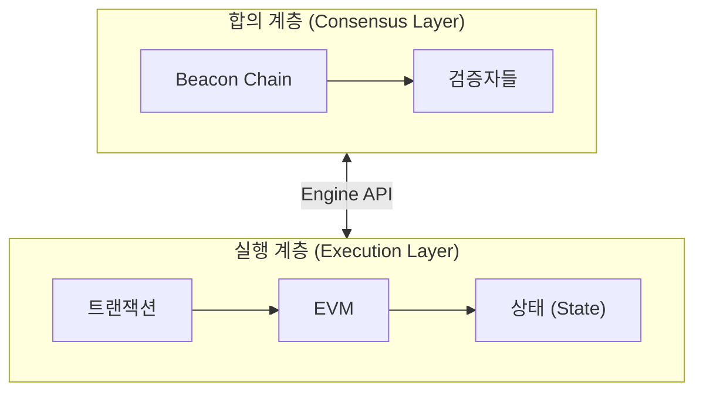
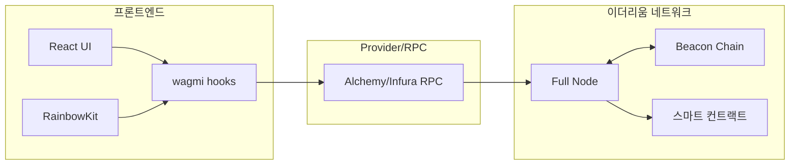

# Week 6 Quiz: Beacon Chain/Finality + Final Project Integration

> **제출 방법:** 이 파일을 복사하여 답변을 작성한 후, PR로 제출하세요.
> **평가 기준:** 개념 이해도 중심 - 6주간 배운 내용을 **통합**하여 설명하세요.

---

## 문제 1: Beacon Chain 역할 (객관식)

Beacon Chain의 **주요 역할**은 무엇인가요?

**보기:**
A) 스마트 컨트랙트를 실행하고 상태를 관리한다
B) 검증자를 관리하고 합의를 조정하며 블록 최종성을 결정한다
C) 트랜잭션 수수료를 계산하고 분배한다
D) 사용자의 지갑을 생성하고 개인키를 관리한다

**답변:**

<!--
정답 알파벳과 Beacon Chain이 "합의 계층(Consensus Layer)"으로서 하는 역할을 설명하세요.
실행 계층(Execution Layer)과의 차이도 언급하면 더 좋습니다.
-->

B 검증자를 등록/관리하고, 지분 증명 방식으로 블록 제안자를 선출하며, 충분한 서명이 모이면 블록을 최종 확정시키는 역할을 함. Execution Layer이 transaction처리, 스마트 컨트랙트 실행, 상태 변경을 담당하는 것과 달리 Beacon Chain은 실제 연산을 수행하지 않고 "누가 블록을 만들 수 있는가"를 결정하는 합의 조정에만 집중함. 두 계층은 The Merge(2022)이후 분리되어 함께 작동.

---

## 문제 2: Finality 개념 (객관식)

이더리움에서 **Finality(최종성)**가 달성되면 어떤 상태인가요?

**보기:**
A) 트랜잭션이 mempool에 들어간 상태
B) 블록이 체인에 추가되었지만 아직 재조직(reorg)될 수 있는 상태
C) 전체 검증자의 1/3 이상이 슬래싱되지 않는 한 절대 변경되지 않는 상태
D) 24시간이 지나서 트랜잭션이 만료된 상태

**답변:**

<!--
정답 알파벳과 왜 "1/3 이상 슬래싱"이 조건인지 설명하세요.
Finality가 왜 중요한지도 언급하세요.
-->

C Finality가 달성된 블록을 되돌리려면 검증자 1/3 이상이 슬래싱을 감수해야 함. 이는 이더리움 PoS가 2/3 초과 동의로 블록을 확정하는 BFT 설계이기 때문으로, 1/3 미만의 악의적 검증자로는 절대 번복이 불가능함. 이 보장 덕분에 거래소/디파이 등 실제 서비스가 transaction을 안전하게 신뢰할 수 있음.

---

## 문제 3: 왜 Finality가 중요한가 (단답형)

거래소나 dApp 개발자에게 **Finality**가 왜 중요한가요?
다음 시나리오를 예로 들어 설명하세요:

> 사용자가 거래소에 100 ETH를 입금하고, 거래소가 확인 후 내부 잔액에 반영했습니다.
> 그런데 나중에 블록 재조직(reorg)이 발생하여 입금 트랜잭션이 사라졌습니다.

**답변:**

<!--
1) 위 시나리오에서 거래소에 어떤 문제가 발생하나요?

2) Finality가 있으면 이 문제가 어떻게 해결되나요?

3) 이더리움에서 Finality까지 얼마나 기다려야 하나요?
-->

1. 거래소의 문제 reorg로 입금 transaction이 사라졌음에도 거래소는 이미 내부 잔액에 100ETH를 반영했으므로, 사용자가 해당 잔액을 출금하면 거래소가 그대로 손실을 떠안게 됨.
2. Finality로 해결 Finality가 확정된 블록의 transaction은 reorg가 불가능하므로, 거래소는 Finality를 확인한 후에만 잔액을 변경하면 위와 같은 이중지불 리스크를 원천 차단할 수 있음.
3. 대기시간은 이더리움에서 Finality까지 약 12분 정도 소요됨.

---

## 문제 4: 포크 선택 규칙 (단답형)

이더리움은 **Casper FFG**와 **LMD-GHOST** 두 가지 메커니즘을 결합합니다.
각각의 역할은 무엇이며, **왜** 둘 다 필요한가요?

**답변:**

<!--
1) Casper FFG의 역할:

2) LMD-GHOST의 역할:

3) 왜 둘 다 필요한가 (한쪽만 있으면 어떤 문제?):
-->

1. Casper FFG의 역할 - 에포크 단위로 체크포인트를 선정하고, 검증자 2/3이상의 서명을 모아 블록 최종 확정(Finality) 시킴. '이 블록은 절대 되돌릴 수 없다'는 보장을 제공함.

2. LMD-GHOST의 역할 - 매 슬롯(12초)마다 검증자들의 최신 투표(attestation)를 기준으로 가장 무거운 fork를 정식 체인으로 선택. Finality 확정 전까지 실시간으로 어느 체인을 따를지 결정.

3. 왜 둘 다 필요?

- Casper FFG만 있으면 - Finality는 보장되지만 에포크 사이 동안 어느 블록을 따라야 할지 기준이 없어 체인이 분기될 수 있음. - 최종 확정 담당
- LMD-GHOST만 존재하면 - 체인 선택은 빠르지만 Finality가 없어 블록이 언제든 reorge될 수 있음. 거래를 영구적으로 신뢰할 수 없음. - 빠른 블록 선택 담당

---

## 문제 5: dApp 아키텍처 설계 (코드/아키텍처 문제)

당신은 "간단한 투표 dApp"을 만들려고 합니다.
다음 요구사항을 읽고 **컴포넌트 구조**와 **사용할 hook**들을 설계하세요.

**요구사항:**

- 사용자가 지갑을 연결할 수 있다
- 현재 투표 현황(찬성/반대 수)을 조회할 수 있다
- 사용자가 찬성 또는 반대 투표를 할 수 있다
- 투표 후 결과가 화면에 즉시 반영된다

**답변:**
<!--


 -->

1) 컴포넌트 구조 (어떤 컴포넌트가 필요한가):
App
├── WalletButton        # 지갑 연결/해제 버튼, 연결된 주소 표시
├── VoteStatus          # 찬성/반대 현황 수치 표시
└── VoteActions         # 찬성·반대 버튼, 트랜잭션 상태 표시


2) 각 컴포넌트에서 사용할 wagmi/RainbowKit hook:
   - 지갑 연결: useConnect() - RainbowKit 연결, useAccount() - 연결 주소/상태 확인
   - 투표 현황 조회: useReadContract() - contract의 getVotes() 함수를 주기적으로 read, 
    -- useBlockNumber() - 새 블록마다 자동 refetch 트리거 -> 투표 현황을 실시간으로 업데이트하는 자동 갱신 로직에 필수적임. 
    -- useWatchContractEvent() - 특정 이벤트 발생 시 자동으로 refetch 트리거 -> useBlockNumber()와 다르게 내가 관심 있는 이벤트가 발생했을 때 동작하므로 RPC노드에 가하는 요청 횟수를 줄여 비용을 아끼고 성능을 최적화할 수 있음.
   - 투표 실행: useWriteContract() - vote(true/false) transaction 전송 -> 호출 시 반환되는 hash 값이 다음 단계의 입력값이 됨. 
   - 트랜잭션 확인: useWaitForTransactionReceipt() - tx hash를 받아 confirmed 상태 감지 후 VoteStatus 갱신 


3) Provider 계층 구조:
```
<WagmiProvider config={wagmiConfig}>
  <QueryClientProvider client={queryClient}>   // useReadContract 캐싱
    <RainbowKitProvider>                        // 지갑 연결 UI
      <App />
    </RainbowKitProvider>
  </QueryClientProvider>
</WagmiProvider>
```

**왜 이렇게 설계했나요:**

<!--
각 hook의 선택 이유와 데이터 흐름을 설명하세요.
-->


WagmiProvider -> QueryClientProvider 순서가 공식 권장 구조임.
WagmiProvider가 체인/커넥터 등 config를 먼저 초기화하고, 그 안의 QueryClientProvider가 wagmi hook들의 데이터를 캐싱/관리함. 


---

## 문제 6: 컨트랙트-프론트엔드 연동 (빈칸 채우기)

다음 코드의 빈칸을 채워서 투표 컨트랙트와 프론트엔드를 연동하세요:

**Solidity 컨트랙트:**

```solidity
contract Voting {
  uint256 public yesVotes;
  uint256 public noVotes;

  function voteYes() external {
    yesVotes += 1;
  }

  function voteNo() external {
    noVotes += 1;
  }
}
```

**React 컴포넌트:**

```typescript
import { useReadContract, useWriteContract, _________________ } from 'wagmi';

const votingABI = [
  { name: 'yesVotes', type: 'function', stateMutability: 'view', inputs: [], outputs: [{ type: 'uint256' }] },
  { name: 'noVotes', type: 'function', stateMutability: 'view', inputs: [], outputs: [{ type: 'uint256' }] },
  { name: 'voteYes', type: 'function', stateMutability: 'nonpayable', inputs: [], outputs: [] },
  { name: 'voteNo', type: 'function', stateMutability: 'nonpayable', inputs: [], outputs: [] },
] as const;

function VotingApp() {
  // 찬성 투표 수 조회
  const { data: yesCount, refetch: refetchYes } = useReadContract({
    address: '0x1234...5678',
    abi: votingABI,
    functionName: '_________________',
  });

  // 반대 투표 수 조회
  const { data: noCount, refetch: refetchNo } = useReadContract({
    address: '0x1234...5678',
    abi: votingABI,
    functionName: '_________________',
  });

  // 투표 실행
  const { writeContract, data: hash, isPending } = useWriteContract();

  // 트랜잭션 확인 대기
  const { isLoading: isConfirming, isSuccess } = _________________({
    hash,
  });

  // 트랜잭션 성공 시 데이터 새로고침
  // TODO: isSuccess가 true가 되면 refetch를 호출해야 함

  const handleVoteYes = () => {
    writeContract({
      address: '0x1234...5678',
      abi: votingABI,
      functionName: '_________________',
    });
  };

  return (
    <div>
      <h2>현재 투표 현황</h2>
      <p>찬성: {_________________}</p>
      <p>반대: {noCount?.toString()}</p>

      <button onClick={handleVoteYes} disabled={isPending || isConfirming}>
        {isPending ? '서명 중...' : isConfirming ? '확인 중...' : '찬성 투표'}
      </button>

      {isSuccess && <p>투표 완료!</p>}
    </div>
  );
}
```

**답변:**

```typescript
// 완성된 코드를 여기에 작성하세요
import { useReadContract, useWriteContract, useWaitForTransactionReceipt } from 'wagmi';

const votingABI = [
  { name: 'yesVotes', type: 'function', stateMutability: 'view', inputs: [], outputs: [{ type: 'uint256' }] },
  { name: 'noVotes', type: 'function', stateMutability: 'view', inputs: [], outputs: [{ type: 'uint256' }] },
  { name: 'voteYes', type: 'function', stateMutability: 'nonpayable', inputs: [], outputs: [] },
  { name: 'voteNo', type: 'function', stateMutability: 'nonpayable', inputs: [], outputs: [] },
] as const;

function VotingApp() {
  // 찬성 투표 수 조회
  const { data: yesCount, refetch: refetchYes } = useReadContract({
    address: '0x1234...5678',
    abi: votingABI,
    functionName: 'yesVotes',
  });

  });

  // 반대 투표 수 조회
  const { data: noCount, refetch: refetchNo } = useReadContract({
    address: '0x1234...5678',
    abi: votingABI,
    functionName: 'noVotes',
  });

  // 투표 실행
  const { writeContract, data: hash, isPending } = useWriteContract();

  // 트랜잭션 확인 대기
  const { isLoading: isConfirming, isSuccess } = useWaitForTransactionReceipt({
    hash,
  });

  // 트랜잭션 성공 시 데이터 새로고침
  // TODO: isSuccess가 true가 되면 refetch를 호출해야 함

  const handleVoteYes = () => {
    writeContract({
      address: '0x1234...5678',
      abi: votingABI,
      functionName: 'voteYes',
    });
  };

  return (
    <div>
      <h2>현재 투표 현황</h2>
      <p>찬성: {yesCount?.toString()}</p>
      <p>반대: {noCount?.toString()}</p>

      <button onClick={handleVoteYes} disabled={isPending || isConfirming}>
        {isPending ? '서명 중...' : isConfirming ? '확인 중...' : '찬성 투표'}
      </button>

      {isSuccess && <p>투표 완료!</p>}
    </div>
  );
}
```

**데이터 흐름을 설명하세요:**

<!--
1) 사용자가 "찬성 투표" 버튼 클릭 -> ... -> 화면 업데이트까지의 과정을 설명하세요.
-->

1. 버튼 클릭 - useWriteContract()로 vote(true) transaction 전송
2. 지갑 서명 요청 - 지갑 팝업 -> 사용자 서명 -> tx hash 반환
3. transaction 대기 - useWaitForTransactionReceipt() 호출로 confirmed 상태 감지
4. 확정 후 데이터 갱신 - confirmed 되면 useReadContract() refetch 트리거
5. 화면 업데이트 - refetch된 데이터로 화면 업데이트
---

## 문제 7: 트랜잭션 흐름 디버깅 (취약점 찾기)

다음 코드에서 **문제점**을 찾고 수정하세요. 사용자가 투표를 해도 화면이 업데이트되지 않습니다.

```typescript
// BAD CODE - 왜 화면이 업데이트되지 않나요?
function BrokenVoting() {
  const { data: voteCount } = useReadContract({
    address: '0x...',
    abi: votingABI,
    functionName: 'yesVotes',
  });

  const { writeContract, data: hash } = useWriteContract();

  const { isSuccess } = useWaitForTransactionReceipt({ hash });

  const handleVote = () => {
    writeContract({
      address: '0x...',
      abi: votingABI,
      functionName: 'voteYes',
    });
  };

  // isSuccess가 true가 되어도 voteCount가 업데이트되지 않음!

  return (
    <div>
      <p>찬성: {voteCount?.toString()}</p>
      <button onClick={handleVote}>투표</button>
      {isSuccess && <p>투표 완료!</p>}
    </div>
  );
}
```

**1) 발견한 문제점:**

<!--
왜 화면이 업데이트되지 않는지 설명하세요.
-->
isSuccess가 true로 바뀌는 순간 re-rendering이 발생하긴 함. 하지만 useReadContract는 transaction확정을 알 방법이 없어 캐시된 이전 데이터를 그대로 들고 있음. re-rendering이 일어나도 voteCount는 여전히 옛날 값이라 UI가 바뀌지 않는 것임. 수정하려면 isSuccess시점에 명시적으로 refetch를 호출해야 함. 

**2) 올바른 수정 방법:**

```typescript
// GOOD CODE - 수정된 버전을 작성하세요
function FixedVoting() {
  const { data: voteCount, refetch } = useReadContract({
    address: '0x...',
    abi: votingABI,
    functionName: 'yesVotes',
  });

  const { writeContract, data: hash } = useWriteContract();

  const { isSuccess } = useWaitForTransactionReceipt({ hash });

  useEffect(() => {
    if (isSuccess) {
      refetch(); // 트랜잭션 확정 후 최신 데이터 요청
    }
  }, [isSuccess]);

  const handleVote = () => {
    writeContract({
      address: '0x...',
      abi: votingABI,
      functionName: 'voteYes',
    });
  };

  return (
    <div>
      <p>찬성: {voteCount?.toString()}</p>
      <button onClick={handleVote}>투표</button>
      {isSuccess && <p>투표 완료!</p>}
    </div>
  );
}
```

**3) refetch가 필요한 이유:**

<!--
블록체인 데이터와 React 상태의 관계를 설명하세요.
-->

React 상태는 메모리(클라이언트)에 있고, 블록체인 데이터는 네트워크(노드)에 있음. useReadContract는 처음 마운트될 때 한 번 데이터를 가져와 TanStackQuery 캐싱 저장하고, 이후 자동으로 갱신하지 않음. transaction이 블록에 확정되어 온체인 상태가 바뀌어도 캐시는 여전히 이전 값을 들고 있으므로, refetch()로 명시적으로 최신 데이터를 다시 요청해야 함. 

---

## 문제 8: Beacon Chain 구조 (다이어그램 해석)

다음 다이어그램은 이더리움의 두 계층 구조를 보여줍니다:



**질문:**

1. **합의 계층(CL)**과 **실행 계층(EL)**의 역할 차이는 무엇인가요?


2. **Engine API**를 통해 두 계층이 주고받는 정보는 무엇인가요?
CL -> EL : engine_forkchiceUpdated - 이 블록을 정식 체인으로 선택했다, 새 블록으로 만들 준비해라.
EL -> CL : engine_newPayload - transaction 실행 결과(상태루트, 가스 사용량 등)를 반환하고 유효성 응답

3. 사용자가 트랜잭션을 전송하면 CL과 EL에서 각각 어떤 일이 일어나나요?
EL : mempool에 트랜잭션 수신 및 대기
CL : 슬롯마다 검증자 중 블록 제안자 선출
CL -> EL : 블록 생성 요청 (engine API)
EL : mempool에서 트랜잭션 선택 -> EVM 실행 -> 상태 변경 -> 블록 반환 
EL -> CL : 실행 결과 전달 (Engine API) 
CL : 검증자들이 블록 서명 -> Finality 확정


---

## 문제 9: Slot/Epoch 관계 (다이어그램 해석)

다음 다이어그램은 Slot과 Epoch의 관계를 보여줍니다:

```mermaid
gantt
    title Epoch 구조 (6.4분)
    dateFormat X
    axisFormat %s

    section Epoch N
    Slot 0     :a1, 0, 12
    Slot 1     :a2, 12, 24
    Slot 2     :a3, 24, 36
    ...        :a4, 36, 372
    Slot 31    :a5, 372, 384

    section Checkpoint
    Epoch N 끝 :milestone, 384, 0
```



**질문:**

1. 1 Slot은 몇 초이고, 1 Epoch은 몇 개의 Slot으로 구성되나요?
Slot은 12초이고, 1 Epoch는 32개의 Slot으로 구성되며 약 6.4분이다.

2. **Checkpoint**는 언제 발생하며 어떤 역할을 하나요?
매 Epoch의 마지막 슬록(Slot 31)에서 발생한다. 검증자들이 해당 Epoch의 마지막 블록에 attestation을 모아 '이 블록까지는 유효하다'고 합의한 기준점임. Casper FFG는 이 Checkpoint단위로 Finality를 판단함. 

3. **Finality**가 달성되려면 몇 Epoch이 필요하고, 시간으로는 약 몇 분인가요?
Finality가 달성하기까지 최소 2 Epoch가 필요하고, 이는 약 12.8분이다. 


Epoch N : Checkpoint생성
Epoch N+1 : 검증자 2/3 이상이 Epoch N의 Checkpoint에 서명 -> Epoch N 최종 확정(Finalized)

---

## 문제 10: dApp 전체 아키텍처 (다이어그램 해석)

다음 다이어그램은 dApp의 전체 아키텍처를 보여줍니다:



**질문:**

1. 사용자가 **"투표하기" 버튼**을 클릭하면, UI에서 스마트 컨트랙트까지 데이터가 어떤 경로로 전달되나요?

투표하기 -> React UI(이벤트 발생) -> wagmi hooks (useWriteContract로 tx생성) -> RainbowKit 지갑 서명 요청 -> Alchemy/Infura RPC 서명된 tx 전달 -> Ethereum Full Node tx 수신 및 전파 -> smart contract를 EVM에서 실행

2. **RPC Provider**(Alchemy/Infura)의 역할은 무엇인가요? 없다면 어떤 문제가 생기나요?
프론트엔드가 이더리움 노드와 직접 통신할 수 없기 때문에, Alchemy/Infura가 중간 통신 창구 역할을 함. 없다면 사용자가 직접 풀노드를 운영해야 하고, transaction 전송과 체인 데이터 조회가 불가능함.

3. 6주간 배운 내용을 종합하여, 트랜잭션이 **전송 -> 실행 -> 블록 포함 -> Finality**까지 거치는 전체 흐름을 설명하세요.
  1. 전송 : 사용자 서명 -> RPC -> Full Node의 mempool에 대기 
  2. 실행 : CL이 검증자 중 블록 제안자 선출 (LMD-GHOST) -> Engine API로 EL에 블록 생성 요청 -> EVM이 트랜젝션 실행 -> 상태 변경
  3. 블록 포함 : 실행 결과를 CL에 반환 -> 검증자들이 블록에 attestation -> 블록이 체인에 추가
  4. Finality : Epoch 종료 -> Checkpoint 생성 -> 다음 Epoch에서 검증자 2/3 이상 서명 -> 약 12.8분(2Epoch) 후 Finalized -> 이후 1/3 이상 슬래싱 없이는 절대 되돌릴 수 없음. 

---

## 제출 전 체크리스트

- [x] 모든 문제에 답변을 작성했는가?
- [x] 객관식 문제: 정답 선택 **이유**를 설명했는가?
- [x] 단답형 문제: 2-3문장 이상으로 충분히 설명했는가?
- [x] 코드 문제: 완성된 코드와 **왜 그렇게 작성했는지** 설명했는가?
- [x] 다이어그램 문제: 6주간 배운 내용을 **연결**지어 설명했는가?

---

## 6주 과정 축하합니다!

이 퀴즈를 완료하면 6주 이더리움 온보딩 이론 과정이 마무리됩니다.

**배운 것들:**

- Week 1: State, Account, EOA vs CA
- Week 2: Transaction, Signature, Security (Private Key)
- Week 3: EVM, Gas, Security (Reentrancy, CEI)
- Week 4: Block, Network, MPT, Security (Eclipse, 51%)
- Week 5: PoS, Validator, Consensus, RainbowKit
- Week 6: Beacon Chain, Finality, Full-stack Integration

**다음 단계:** 나만의 dApp 프로젝트를 시작하세요!
